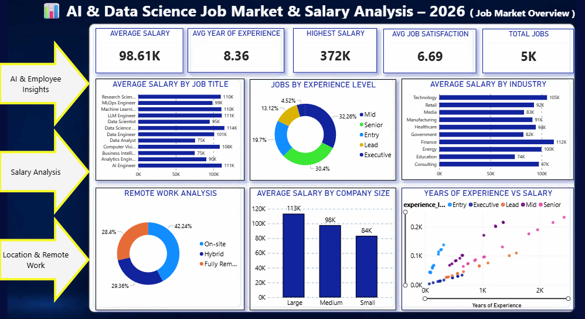
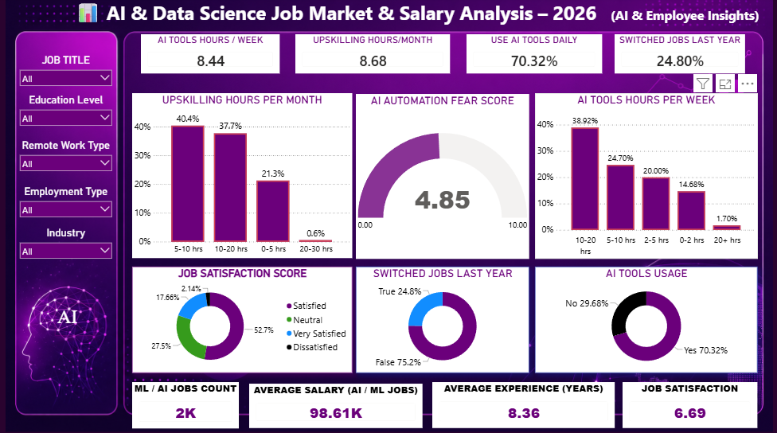
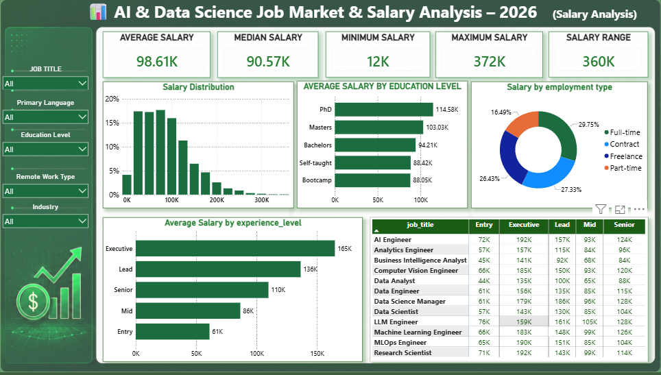
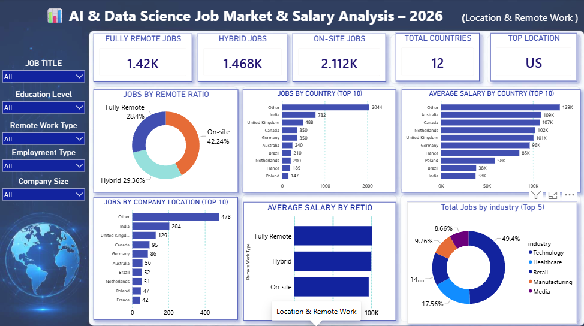

# 📊 AI & Data Science Job Market 2026

---

## 🖼️ Dashboard Screenshots

### 📌 1. Job Market Overview

---

### 📌 2. Salary & Career Analysis

---

### 📌 3. AI Adoption & Employee Insights

---

### 📌 4. Executive Insights

---

## 📌 Project Overview

**AI & Data Science Job Market 2026** is an interactive **Power BI dashboard** designed to analyze job-market trends across Artificial Intelligence, Data Science, Machine Learning, and related technology roles.

The dashboard provides insights into:

* 💼 Job roles
* 💰 Salaries
* 🎓 Experience levels
* 😊 Employee satisfaction
* 🤖 AI adoption
* 🌍 Remote work
* ⚠️ AI-related concerns

---

## 🎯 Objectives

* Analyze AI & Data Science job-market trends.
* Compare salaries across job roles and experience levels.
* Understand employee satisfaction.
* Analyze remote-work opportunities.
* Explore AI adoption in the workplace.
* Study AI-related workplace concerns.

---

## 🛠️ Tools & Technologies

| Tool              | Purpose                        |
| ----------------- | ------------------------------ |
| 📊 Power BI       | Dashboard & Visualization      |
| 📈 Data Analytics | Data Analysis                  |
| 🧮 DAX            | Calculations & Measures        |
| 🔄 Power Query    | Data Cleaning & Transformation |

---

## 📊 Dashboard Pages

### 1️⃣ Job Market Overview

Overview of job roles, experience levels, salaries, and employment trends.

### 2️⃣ Salary & Career Analysis

Analysis of salary patterns across job roles and experience levels.

### 3️⃣ AI Adoption & Employee Insights

Analysis of AI adoption, employee satisfaction, remote work, and AI concerns.

### 4️⃣ Executive Insights

Summary of major job-market, salary, AI adoption, and employee insights.

---

## 🔎 Dashboard Filters

* Job Title
* Experience Level
* Salary
* AI Adoption
* Employee Satisfaction
* Remote Work
* AI Fear / Concern

---

## 📈 Key Analysis

The dashboard analyzes:

* Job titles
* Experience levels
* Salary
* Employee satisfaction
* AI adoption
* AI fear / concern
* Remote work ratio
* Career trends

---

## 👨‍💻 Author

### SARAVANAN D

**Power BI | Data Analytics | AI & Technology**

📧 **Email:** [saravananbass12@gmail.com](mailto:saravananbass12@gmail.com)

📍 **Tamil Nadu, India**

💻 **GitHub:**
https://github.com/saravananbass12-tech

---

### ⭐ AI & Data Science Job Market 2026

**Power BI • Data Analytics • AI & Technology**

